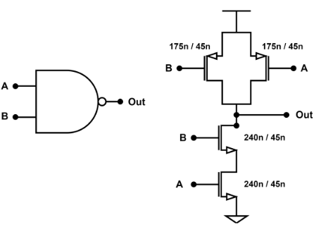
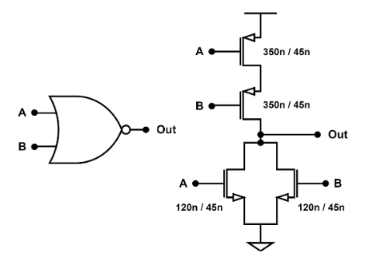
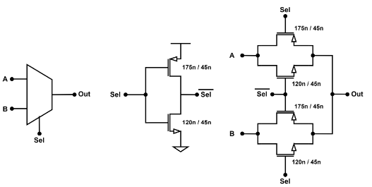

# CMOS Standard Cell Library — Full-Custom Design (Cadence Virtuoso)

This repository presents the **development of a CMOS standard-cell library**, entirely designed in **full-custom** style using **Cadence Virtuoso**.  
Each logic gate was **sized, laid out, and characterized** to achieve balanced delays and minimized area.  
The project follows a consistent design methodology, using the **inverter (NOT)** as the reference for sizing all other cells.

> **Design Principles**
>
> - The **NOT** gate was used as the base reference.  
> - Optimal ratio: \( W_p / W_n = 1.45833 \).  
> - For **N transistors in series**, the total width \( W \) was multiplied by **N** to preserve equivalent drive strength.  
> - The channel length \( L \) remained at the **minimum technology value**.

---

## 📁 Repository Structure

```
stdcell-lib/
├─ README.md
├─ Docs/
│  └─ RELATORIO_CCI-1.pdf
└─ Figures/
   ├─ (all figures used in the report, same filenames)
```

- **Docs/** → Full report in PDF.  
- **Figures/** → Schematics, symbols, and layouts.  

---

## 🔹 NOT Gate


<table>
<tr>
<td style="width:50%; vertical-align:top;">
<div style="padding:12px; text-align:center;">
  
</div>
</td>
<td style="width:50%; vertical-align:top;">
  
**Truth Table**  
  
| A | Q |
|:-:|:-:|
| 0 | 1 |
| 1 | 0 |
</td>
</tr>
</table>

**Functional Code (VHDL)**  
```vhdl
Q <= not A;
```

<table>
<tr>
<td style="width:55%; vertical-align:top;">
<div align="center">
  
</div>
</td>
<td style="width:45%; vertical-align:top; padding-left:12px;">

**Area (µm²)**  

| Standard Cells | Full Custom |
|---:|---:|
| 0.8208 | 0.8208 |
</td>
</tr>
</table>

---

## 🔹 NAND Gate

<table>
<tr>
<td style="width:50%; vertical-align:top;">
<div style="background-color:#ffffff; padding:8px; text-align:center;">
  
</div>
</td>
<td style="width:50%; vertical-align:top;">

**Truth Table**  

| A | B | Q |
|:-:|:-:|:-:|
| 0 | 0 | 1 |
| 0 | 1 | 1 |
| 1 | 0 | 1 |
| 1 | 1 | 0 |
</td>
</tr>
</table>

**Functional Code (VHDL)**  
```vhdl
Q <= not (A and B);
```

<table>
<tr>
<td style="width:55%; vertical-align:top;">
<div align="center">
  
</div>
</td>
<td style="width:45%; vertical-align:top; padding-left:12px;">

**Area (µm²)**

| Standard Cells | Full Custom |
|---:|---:|
| 1.1457 | 1.1457 |
</td>
</tr>
</table>

---

## 🔹 NOR Gate

<table>
<tr>
<td style="width:50%; vertical-align:top;">
<div style="background-color:#ffffff; padding:8px; text-align:center;">
  
</div>
</td>
<td style="width:50%; vertical-align:top;">

**Truth Table**  

| A | B | Q |
|:-:|:-:|:-:|
| 0 | 0 | 1 |
| 0 | 1 | 0 |
| 1 | 0 | 0 |
| 1 | 1 | 0 |
</td>
</tr>
</table>

**Functional Code (VHDL)**  
```vhdl
Q <= not (A or B);
```

<table>
<tr>
<td style="width:55%; vertical-align:top;">
<div align="center">
  
</div>
</td>
<td style="width:45%; vertical-align:top; padding-left:12px;">

**Area (µm²)**

| Standard Cells | Full Custom |
|---:|---:|
| 1.1457 | 1.1457 |
</td>
</tr>
</table>

---

## 🔹 AND Gate

<table>
<tr>
<td style="width:50%; vertical-align:top;">
<div style="background-color:#ffffff; padding:8px; text-align:center;">
  
</div>
</td>
<td style="width:50%; vertical-align:top;">

**Truth Table**  

| A | B | Q |
|:-:|:-:|:-:|
| 0 | 0 | 0 |
| 0 | 1 | 0 |
| 1 | 0 | 0 |
| 1 | 1 | 1 |
</td>
</tr>
</table>

**Functional Code (VHDL)**  
```vhdl
Q <= A and B;
```

<table>
<tr>
<td style="width:55%; vertical-align:top;">
<div align="center">
  
</div>
</td>
<td style="width:45%; vertical-align:top; padding-left:12px;">

**Area (µm²)**

| Standard Cells | Full Custom |
|---:|---:|
| 1.9665 | 1.4962 |
</td>
</tr>
</table>

---

## 🔹 OR Gate

<table>
<tr>
<td style="width:50%; vertical-align:top;">
<div style="background-color:#ffffff; padding:8px; text-align:center;">
  
</div>
</td>
<td style="width:50%; vertical-align:top;">

**Truth Table**  

| A | B | Q |
|:-:|:-:|:-:|
| 0 | 0 | 0 |
| 0 | 1 | 1 |
| 1 | 0 | 1 |
| 1 | 1 | 1 |
</td>
</tr>
</table>

**Functional Code (VHDL)**  
```vhdl
Q <= A or B;
```

<table>
<tr>
<td style="width:55%; vertical-align:top;">
<div align="center">
  
</div>
</td>
<td style="width:45%; vertical-align:top; padding-left:12px;">

**Area (µm²)**

| Standard Cells | Full Custom |
|---:|---:|
| 1.9665 | 1.4962 |
</td>
</tr>
</table>

---

## 🔹 XOR Gate

<table>
<tr>
<td style="width:50%; vertical-align:top;">
<div style="background-color:#ffffff; padding:8px; text-align:center;">
  
</div>
</td>
<td style="width:50%; vertical-align:top;">

**Truth Table**  

| A | B | Q |
|:-:|:-:|:-:|
| 0 | 0 | 0 |
| 0 | 1 | 1 |
| 1 | 0 | 1 |
| 1 | 1 | 0 |
</td>
</tr>
</table>

**Functional Code (VHDL)**  
```vhdl
Q <= A xor B;
```

<table>
<tr>
<td style="width:55%; vertical-align:top;">
<div align="center">
  
</div>
</td>
<td style="width:45%; vertical-align:top; padding-left:12px;">

**Area (µm²)**

| Standard Cells | Full Custom |
|---:|---:|
| 4.8222 | 1.8468 |
</td>
</tr>
</table>

---

## 🔹 XNOR Gate

<table>
<tr>
<td style="width:50%; vertical-align:top;">
<div style="background-color:#ffffff; padding:8px; text-align:center;">
  
</div>
</td>
<td style="width:50%; vertical-align:top;">

**Truth Table**  

| A | B | Q |
|:-:|:-:|:-:|
| 0 | 0 | 1 |
| 0 | 1 | 0 |
| 1 | 0 | 0 |
| 1 | 1 | 1 |
</td>
</tr>
</table>

**Functional Code (VHDL)**  
```vhdl
Q <= not (A xor B);
```

<table>
<tr>
<td style="width:55%; vertical-align:top;">
<div align="center">
  
</div>
</td>
<td style="width:45%; vertical-align:top; padding-left:12px;">

**Area (µm²)**

| Standard Cells | Full Custom |
|---:|---:|
| 5.6430 | 2.5393 |
</td>
</tr>
</table>

---

## 🔹 Buffer

<table>
<tr>
<td style="width:50%; vertical-align:top;">
<div style="background-color:#ffffff; padding:8px; text-align:center;">
  
</div>
</td>
<td style="width:50%; vertical-align:top;">

**Truth Table**  

| A | Q |
|:-:|:-:|
| 0 | 0 |
| 1 | 1 |
</td>
</tr>
</table>

**Functional Code (VHDL)**  
```vhdl
Q <= A;
```

<table>
<tr>
<td style="width:55%; vertical-align:top;">
<div align="center">
  
</div>
</td>
<td style="width:45%; vertical-align:top; padding-left:12px;">

**Area (µm²)**

| Standard Cells | Full Custom |
|---:|---:|
| 1.6416 | 1.1970 |
</td>
</tr>
</table>

---

## 🔹 Tri-State Inverter

<table>
<tr>
<td style="width:50%; vertical-align:top;">
<div style="background-color:#ffffff; padding:8px; text-align:center;">
  
</div>
</td>
<td style="width:50%; vertical-align:top;">

**Truth Table**  

| A | EN | Q |
|:-:|:-:|:-:|
| 0 | 1 | 1 |
| 1 | 1 | 0 |
| X | 0 | Z |
</td>
</tr>
</table>

**Functional Code (VHDL)**  
```vhdl
Q <= not A when EN = '1' else 'Z';
```

<table>
<tr>
<td style="width:55%; vertical-align:top;">
<div align="center">
  
</div>
</td>
<td style="width:45%; vertical-align:top; padding-left:12px;">

**Area (µm²)**

| Standard Cells | Full Custom |
|---:|---:|
| 1.4022 | 1.4022 |
</td>
</tr>
</table>

---

## 🔹 Buffer Tri-State

<table>
<tr>
<td style="width:50%; vertical-align:top;">
<div style="background-color:#ffffff; padding:8px; text-align:center;">
  
</div>
</td>
<td style="width:50%; vertical-align:top;">

**Truth Table**  

| A | EN | Q |
|:-:|:-:|:-:|
| 0 | 1 | 0 |
| 1 | 1 | 1 |
| X | 0 | Z |
</td>
</tr>
</table>

**Functional Code (VHDL)**  
```vhdl
Q <= A when EN = '1' else 'Z';
```

<table>
<tr>
<td style="width:55%; vertical-align:top;">
<div align="center">
  
</div>
</td>
<td style="width:45%; vertical-align:top; padding-left:12px;">

**Area (µm²)**

| Standard Cells | Full Custom |
|---:|---:|
| 2.2230 | 2.5479 |
</td>
</tr>
</table>

---

## 🔹 Transmission Gate (TG)

<table>
<tr>
<td style="width:50%; vertical-align:top;">
<div style="background-color:#ffffff; padding:8px; text-align:center;">
  
</div>
</td>
<td style="width:50%; vertical-align:top;">

**Truth Table**  

| A | EN | Q |
|:-:|:-:|:-:|
| 0 | 1 | 0 |
| 1 | 1 | 1 |
| X | 0 | Z |
</td>
</tr>
</table>

**Functional Code (VHDL)**  
```vhdl
Q <= A when EN = '1' else 'Z';
```

<table>
<tr>
<td style="width:55%; vertical-align:top;">
<div align="center">
  
</div>
</td>
<td style="width:45%; vertical-align:top; padding-left:12px;">

**Area (µm²)**

| Standard Cells | Full Custom |
|---:|---:|
| 1.5903 | 1.5903 |
</td>
</tr>
</table>

---

## 🔹 Multiplexer 2:1 (MUX)

<table>
<tr>
<td style="width:50%; vertical-align:top;">
<div style="background-color:#ffffff; padding:8px; text-align:center;">
  
</div>
</td>
<td style="width:50%; vertical-align:top;">

**Truth Table**  

| S | A | B | Q |
|:-:|:-:|:-:|:-:|
| 0 | A | B | A |
| 1 | A | B | B |
</td>
</tr>
</table>

**Functional Code (VHDL)**  
```vhdl
Q <= (A and not S) or (B and S);
```

<table>
<tr>
<td style="width:55%; vertical-align:top;">
<div align="center">
  
</div>
</td>
<td style="width:45%; vertical-align:top; padding-left:12px;">

**Area (µm²)**

| Standard Cells | Full Custom |
|---:|---:|
| 4.0014 | 1.8382 |
</td>
</tr>
</table>

---

## 🔹 Latch D

<table>
<tr>
<td style="width:50%; vertical-align:top;">
<div style="background-color:#ffffff; padding:8px; text-align:center;">
  
</div>
</td>
<td style="width:50%; vertical-align:top;">

**Truth Table**  

| EN | D | Q(next) |
|:-:|:-:|:-:|
| 0 | X | Qprev |
| 1 | 0 | 0 |
| 1 | 1 | 1 |
</td>
</tr>
</table>

**Functional Code (VHDL)**  
```vhdl
process (EN, D)
begin
    if (EN = '1') then
        Q <= D;
    end if;
end process;
```

<table>
<tr>
<td style="width:55%; vertical-align:top;">
<div align="center">
  
</div>
</td>
<td style="width:45%; vertical-align:top; padding-left:12px;">

**Area (µm²)**

| Standard Cells | Full Custom |
|---:|---:|
| 6.4638 | 2.8899 |
</td>
</tr>
</table>

---

## 🔹 Flip-Flop D

<table>
<tr>
<td style="width:50%; vertical-align:top;">
<div style="background-color:#ffffff; padding:8px; text-align:center;">
  
</div>
</td>
<td style="width:50%; vertical-align:top;">

**Truth Table**  

| CLK | D | Q(next) |
|:-:|:-:|:-:|
| ↑  | 0 | 0 |
| ↑  | 1 | 1 |
</td>
</tr>
</table>

**Functional Code (VHDL)**  
```vhdl
process (CLK)
begin
    if rising_edge(CLK) then
        Q <= D;
    end if;
end process;
```

<table>
<tr>
<td style="width:55%; vertical-align:top;">
<div align="center">
  
</div>
</td>
<td style="width:45%; vertical-align:top; padding-left:12px;">

**Area (µm²)**

| Standard Cells | Full Custom |
|---:|---:|
| 12.1068 | 4.6426 |
</td>
</tr>
</table>

---

## 🧠 Final Notes

- All cells were **sized based on the NOT gate** with \( W_p/W_n = 1.45833 \).  
- For series-connected devices, \( W \) was multiplied by the number of stacked transistors.  
- Area comparisons are based on the values reported in the project’s technical report.  


